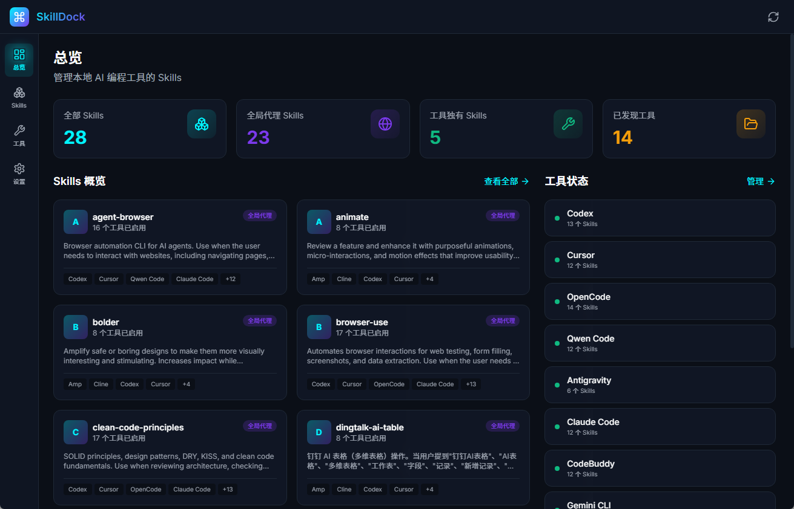
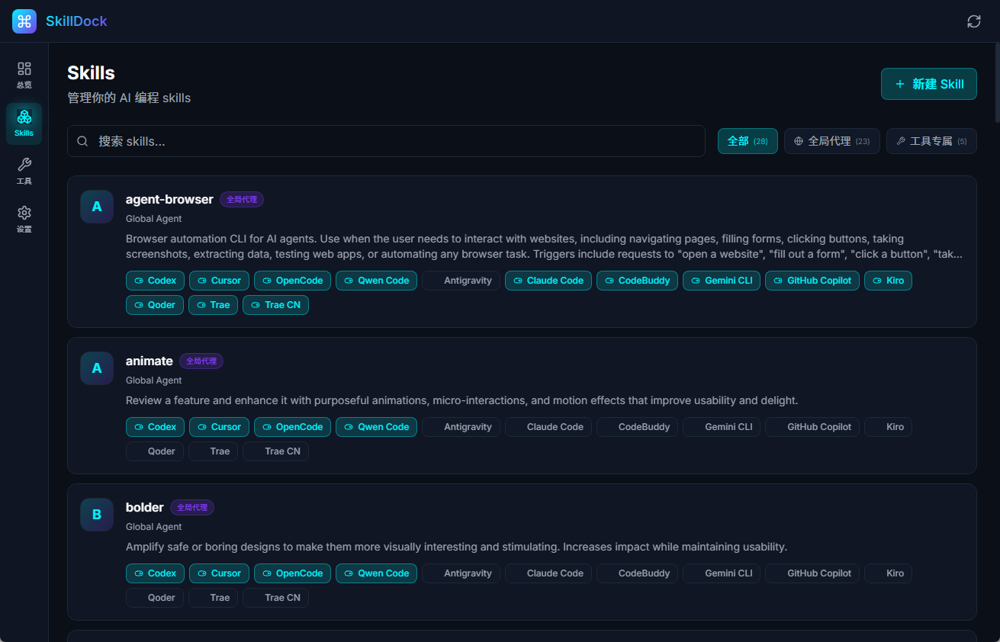
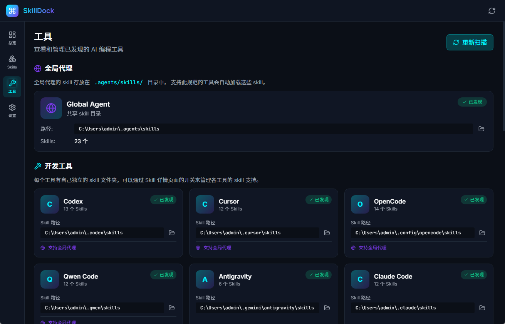

# SkillManager

[](https://github.com/anyaoqi/skill-dock/releases)
[](LICENSE)
[]()

A cross-platform desktop application for managing AI coding assistant skills across multiple tools. 🚀

**[中文文档](README_CN.md)**

---

## ✨ Overview

SkillManager provides a unified interface to manage skills (prompts/instructions) for various AI coding assistants like OpenCode, Cursor, Claude Code, GitHub Copilot, and more. It allows you to:

- 🔍 Scan and discover existing skills across all your AI tools
- ⚡ Enable/disable skills for specific tools with one click
- 🔗 Share skills across multiple tools via symbolic links/junctions
- 📝 Create new skills with proper SKILL.md templates
- 🗑️ Delete skills from any source

## 🛠️ Supported Tools

| Tool | Skill Path | Supports Global Agent |
|------|------------|----------------------|
| Global Agent | `.agents/skills` | - |
| OpenCode | `.config/opencode/skills` | ✅ |
| Cursor | `.cursor/skills` | ✅ |
| Cline | `.cline/skills` | ✅ |
| Amp | `.amp/skills` | ✅ |
| Codex | `.codex/skills` | ✅ |
| Kimi Code CLI | `.kimi-code/skills` | ✅ |
| Qwen Code | `.qwen/skills` | ✅ |
| Warp | `.warp/skills` | ✅ |
| Claude Code | `.claude/skills` | ❌ |
| Gemini CLI | `.gemini/skills` | ❌ |
| Antigravity | `.gemini/antigravity/skills` | ❌ |
| GitHub Copilot | `.copilot/skills` | ❌ |
| Kiro | `.kiro/skills` | ❌ |
| Qoder | `.qoder/skills` | ❌ |
| Trae | `.trae/skills` | ❌ |
| Trae CN | `.trae-cn/skills` | ❌ |
| Windsurf | `.windsurf/skills` | ❌ |
| Augment Code | `.augment/skills` | ❌ |

> 💡 Tools marked "✅" can share skills from the `.agents/skills` directory via symbolic links.

## 🎯 Features

- **🔎 Skill Discovery**: Automatically scan all skill directories across configured tools
- **📊 Unified Management**: View and manage all skills in a single interface
- **🔄 Cross-Tool Sharing**: Enable a skill for multiple tools with a single toggle
- **✨ Skill Creation**: Create new skills with proper SKILL.md frontmatter templates
- **👁️ File Preview**: View skill files directly within the application
- **📂 Explorer Integration**: Open skill directories in your system file manager

## 💻 Interface Showcase

### 🏠 Home Dashboard


### 📚 Skills Management


### 🔧 Tools Interface


## 📦 Installation

### ⬇️ Download

Download the latest release from [GitHub Releases](https://github.com/anyaoqi/skill-dock/releases):

- **Windows**: `.msi` or `.exe` installer
- **macOS**: `.dmg` or `.app`
- **Linux**: `.deb`, `.rpm`, or `.AppImage`

### 🏗️ Build from Source

**Prerequisites:**
- Node.js 20+
- pnpm 9+
- Rust (latest stable)

```bash
# Clone the repository
git clone https://github.com/anyaoqi/skill-dock.git
cd skill-dock

# Install dependencies
pnpm install

# Build and run
pnpm tauri dev
```

## 📖 Usage

### 🧭 Navigation

- **📊 Dashboard**: Overview of your skills and tools
- **📚 Skills**: View, search, filter, and manage all skills
- **🔧 Tools**: Configure and view tool-specific settings
- **⚙️ Settings**: Application preferences

### 🔨 Managing Skills

1. **👀 View Skills**: All discovered skills are listed with their source and enabled tools
2. **🔍 Filter**: Use category filters (Global Agent / Tool-specific) or search by name
3. **⚡ Enable/Disable**: Toggle skills for specific tools using the tool badges
4. **➕ Create**: Click the "+" button to create a new skill
5. **🗑️ Delete**: Use the trash icon to permanently remove a skill

### 📁 Skill Structure

Skills follow the standard SKILL.md format:

```
skill-name/
├── SKILL.md          # Main skill definition
├── prompts/          # Prompt templates (optional)
├── references/       # Reference documents (optional)
└── scripts/          # Utility scripts (optional)
```

**SKILL.md format:**

```markdown
---
name: skill-name
description: Brief description of the skill
---

# Skill Name

Detailed instructions and content...
```

## 🛠️ Tech Stack

- **🎨 Frontend**: Vue 3, TypeScript, UnoCSS, Vue Router, Pinia
- **⚙️ Backend**: Tauri 2 (Rust)
- **📦 Build**: Vite, pnpm

## 💻 Development

```bash
# Development mode
pnpm dev

# Build frontend only
pnpm build

# Build Tauri app
pnpm tauri build
```

## 🤝 Contributing

Contributions are welcome! Please feel free to submit a Pull Request. 💪

1. Fork the repository
2. Create your feature branch (`git checkout -b feature/amazing-feature`)
3. Commit your changes (`git commit -m 'feat: add amazing feature'`)
4. Push to the branch (`git push origin feature/amazing-feature`)
5. Open a Pull Request

## 📄 License

This project is licensed under the MIT License - see the [LICENSE](LICENSE) file for details.

## 🙏 Acknowledgments

- [Tauri](https://tauri.app/) - Cross-platform desktop app framework
- [Vue.js](https://vuejs.org/) - Progressive JavaScript framework
- All the AI coding assistant tools that inspired this project
